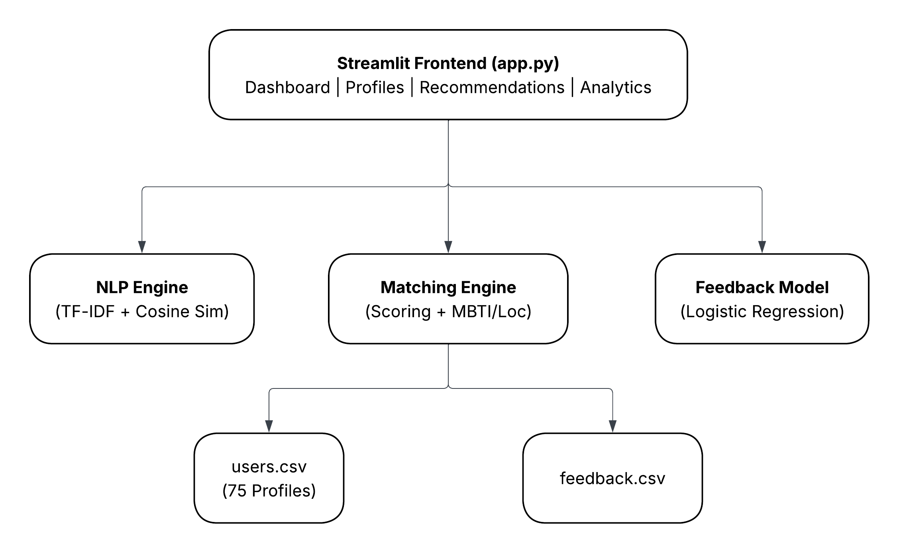
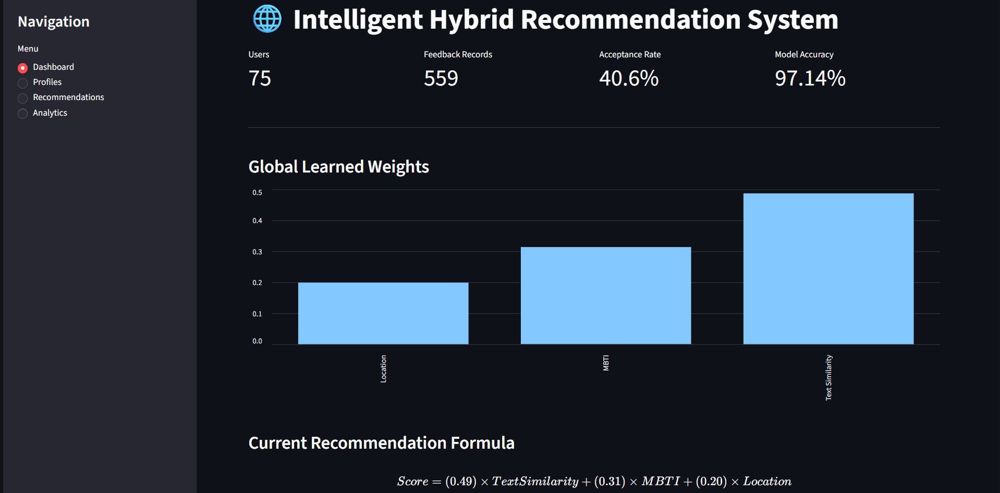
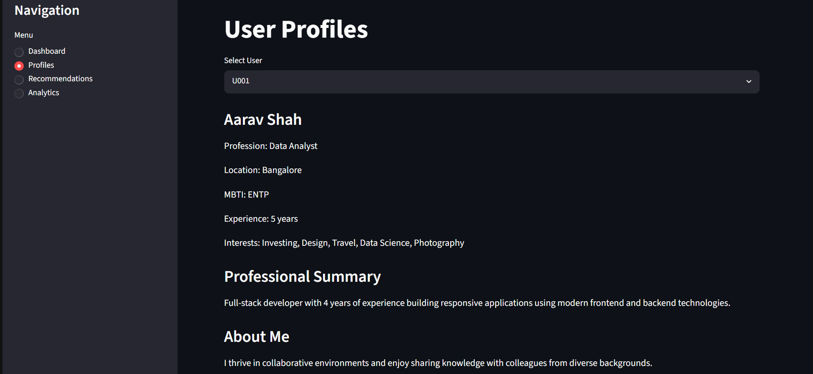
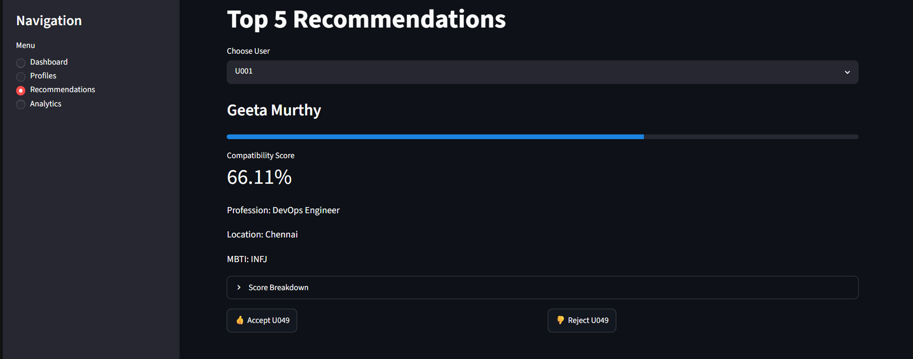
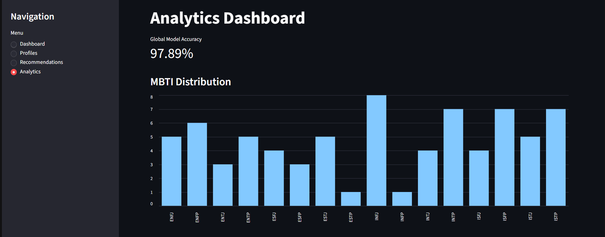

# 🌐 Intelligent Hybrid Recommendation System

A machine learning-powered recommendation system that combines **Natural Language Processing (NLP)**, **MBTI personality compatibility**, **location similarity**, and **adaptive feedback learning** to generate personalized user recommendations.

---

## 📌 Overview

Traditional recommendation systems often rely on static filters or simple keyword matching. This project introduces a **Hybrid Recommendation System** that:

- Understands user profiles using NLP.
- Computes semantic similarity between users.
- Incorporates MBTI personality compatibility.
- Considers geographical proximity.
- Learns from user feedback using Machine Learning.
- Continuously improves recommendations over time.

The project is built using **Python**, **Scikit-learn**, **NLTK**, and **Streamlit**.

---

## 🚀 Features

### NLP-Based Semantic Matching

- Text preprocessing

  - Lowercasing
  - Stopword removal
  - Punctuation removal
  - Lemmatization
- TF-IDF Vectorization
- Cosine Similarity Calculation

### Hybrid Compatibility Scoring

Combines:

- Professional Similarity
- Personality Compatibility (MBTI)
- Location Similarity

### Adaptive Learning

- Accept / Reject feedback collection
- Logistic Regression based learning
- Dynamic recommendation weights
- Personalized user-specific adaptation

### Interactive Dashboard

Built with Streamlit:

- Dashboard
- User Profiles
- Top Recommendations
- Analytics & Performance Monitoring

---

## 🏗️ System Architecture



---

## 📂 Project Structure

```text
Intelligent-Hybrid-Recommendation-System/code/
│
├── app.py
├── data_pipeline.py
├── nlp_engine.py
├── matching_engine.py
├── feedback_model.py
├── requirements.txt
│
├── data/
│   ├── users.csv
│   └── feedback.csv
│
└── README.md
```

---

## 📊 Dataset

### Users Dataset

Contains synthetic professional profiles.

#### Columns

| Column               | Description             |
| -------------------- | ----------------------- |
| user_id              | Unique user identifier  |
| name                 | User name               |
| age                  | User age                |
| location             | City                    |
| profession           | Job role                |
| experience_years     | Years of experience     |
| professional_summary | Professional background |
| about_me             | Personal description    |
| mbti                 | Personality type        |
| interests            | User interests          |

#### Dataset Size

- 75 Users
- 10 Locations
- 10 Professions
- 16 MBTI Types

### Feedback Dataset

Stores recommendation interactions.

#### Columns

| Column          | Description              |
| --------------- | ------------------------ |
| user_id         | Active user              |
| matched_user_id | Recommended user         |
| text_score      | NLP similarity score     |
| mbti_score      | MBTI compatibility score |
| location_score  | Location score           |
| action          | Accept (1) / Reject (0)  |
| timestamp       | Interaction time         |

---

## 🧠 NLP Pipeline

The NLP engine processes:

- Professional Summary
- About Me

### Preprocessing Steps

1. Lowercasing
2. Stopword Removal
3. Punctuation Removal
4. Lemmatization

### Vectorization

TF-IDF Vectorizer

### Similarity Measure

Cosine Similarity

Output:

```text
0.0 → Completely Different
1.0 → Highly Similar
```

---

## 🎯 Recommendation Formula

Initial weights:

```text
Text Similarity = 0.50
MBTI Score      = 0.30
Location Score  = 0.20
```

Compatibility Score:

```text
Score = (w1 × Text Similarity) + (w2 × MBTI Score) + (w3 × Location Score)
```

The score is normalized to a scale of 0–100.

---

## 🤖 Adaptive Learning

The system learns from user interactions.

### Feedback Actions

- 👍 Accept
- 👎 Reject

### Learning Model

Logistic Regression

Input Features:

- Text Similarity Score
- MBTI Compatibility Score
- Location Score

Target Variable:

```text
Accept / Reject
```

### Dynamic Weight Learning

The trained model generates coefficients that are converted into recommendation weights.

Example:

```text
Initial:
Text      = 0.50
MBTI      = 0.30
Location  = 0.20

Learned:
Text      = 0.62
MBTI      = 0.24
Location  = 0.14
```

---

## 🖥️ Streamlit Application

### Dashboard



Displays:

- Total Users
- Feedback Records
- Acceptance Rate
- Model Accuracy
- Global Learned Weights

### Profiles



Displays:

- User Information
- Professional Summary
- About Me
- Interests
- MBTI Type

### Recommendations



Displays:

- Top 5 Matches
- Compatibility Scores
- Score Breakdown
- Accept / Reject Actions

### Analytics



Displays:

- MBTI Distribution
- Location Distribution
- Profession Distribution
- Feedback Analysis
- User-Specific Learned Weights
- Model Accuracy
- Recommendation Formula

---

## ⚙️ Installation

Clone the repository:

```bash
git clone https://github.com/PrateekRaj8125/Intelligent-Hybrid-Recommendation-System.git

cd Intelligent-Hybrid-Recommendation-System/code
```

Install dependencies:

```bash
pip install -r requirements.txt
```

### ▶️ Running the Project

#### Step 1: Generate Dataset

```bash
python data_pipeline.py
```

This generates:

```text
data/users.csv
data/feedback.csv
```

#### Step 2: Launch Streamlit App

```bash
streamlit run app.py
```

Open:

```text
http://localhost:8501
```

---

## 📈 Future Enhancements

- BERT / Sentence Transformer Embeddings
- Collaborative Filtering
- Real-Time Database Integration
- User Authentication
- Explainable AI Recommendations
- Graph-Based User Matching
- Cloud Deployment

---

## 🛠️ Tech Stack

- Python
- Pandas
- NumPy
- NLTK
- Scikit-learn
- Streamlit

---

## 📄 License

This project is developed for academic and educational purposes.

---

## 👨‍💻 Author

### Prateek Raj

Computer Science Student

Machine Learning & NLP Enthusiast
